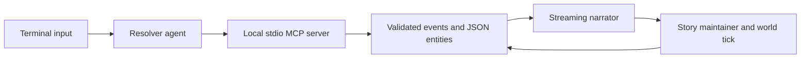

# aidm — AI Dungeon Master

A terminal text RPG with an LLM Dungeon Master and a persistent world stored as
JSON. A resolver agent proposes world changes through validated MCP tools, a
separate narrator streams the scene, and a structured maintainer updates story
memory. Three fictional starting worlds are included; **The Ashford Light** is
the main sample adventure.

This is an experimental, single-player project demonstrating agent orchestration,
tool validation, recoverable file persistence, and deterministic simulation.
Narrative quality depends on the chosen model; it is not a complete tabletop ruleset.

## Requirements and setup

- Python **3.14+** and [uv](https://docs.astral.sh/uv/).
- An OpenAI-compatible **chat completions** endpoint supporting tool calls and
  streaming, such as [llama.cpp's llama-server](https://github.com/ggml-org/llama.cpp),
  or Claude on Google Cloud Vertex AI.
- Run from the repository root: `games/`, `saves/`, and the default config are
  relative to the working directory. The wheel contains the Python package;
  sample worlds and config templates are provided in the checkout/source archive.

From a fresh checkout:

```sh
uv sync --locked
cp -n examples/config.example.json config.json
```

Edit `config.json` with your endpoint and the model identifier accepted by your
server. The example uses `http://localhost:8080/v1`, model `local-model`, and a
placeholder API key `-`. Keep real keys in the ignored config file. A missing or
invalid config is an error; there is no fallback endpoint. The client requests a
120-second timeout and an 8192-token output ceiling by default; provider retries
and reasoning-token accounting can make total turn time and usage differ.

For Vertex, copy `examples/config.vertex.example.json` to a local config, set
your project, region, and available Claude model, and configure Application
Default Credentials (`gcloud auth application-default login` or
`GOOGLE_APPLICATION_CREDENTIALS`). Model access and billing must be enabled in
that project. Use `--config` to select this file. Both provider paths are retained;
the application does not start or install a model server.

## Play

```sh
uv run --locked aidm
# Select a different config or enable diagnostic commands:
uv run --locked aidm --config examples/config.example.json
uv run --locked aidm --dev
```

At the menu:

```text
/games
/new ashford my-save
```

`/new` copies the template and enters the game immediately. Then play in plain
language, for example `talk to the harbormaster about the dark lighthouse`.
Changes are saved as you play. To resume later, use `/load my-save` at the menu.

| Screen | Commands |
| --- | --- |
| Menu | `/games`, `/saves`, `/new <game> <save>`, `/load <save>`, `/delete <save> --confirm`, `/help`, `/quit` |
| Game | `/look`, `/status`, `/quests`, `/inventory`, `/menu`, `/help`, `/quit` |
| With `--dev` or `AIDM_DEV=1` | `/dev` lists store, tool, model, and simulation diagnostics |

Inspection commands do not call the LLM. Save and game names accept 1–100 ASCII
letters, digits, underscores and hyphens; the first character cannot be a hyphen.
Deletion is permanent and requires `--confirm`. Copy an important save elsewhere
while the application is stopped to make a backup.

## How it works



- `domain/` defines Pydantic models; `store/` handles entities, events, transcript,
  metadata, and recovery. `mcp/` exposes read, write, and weighted-outcome tools.
- The engine starts one MCP subprocess lazily. Admin tools and the recorded
  outcome argument are hidden from the model. Tool calls run sequentially.
- Model writes check entity identity, references, protected fields, finite numeric
  state, nonnegative money, liveness, and supported scenario rules. The supported
  rule kind is `forbid_event_type`; forbidding `revive` also blocks health-based
  resurrection. Unknown rule kinds fail validation.
- The resolver mutates state before the narrator sees it. A pending outcome roll
  is attached to the next accepted outcome-bearing write. The model chooses when
  to roll and supplies the weights; these are **not calibrated probabilities**.
- Context includes story memory, the last three transcript turns, the player,
  location, and up to six present entities. The maintainer updates summary, beat
  progress, and NPC inner state. Nearby NPCs receive deterministic regeneration
  or decay; distant NPCs catch up on re-encounter. Time advances on actions, not
  while the player is idle.

## Persistence and privacy

`games/` contains starting templates. `saves/<name>/` holds a copied scenario,
entity files, `events/log.jsonl`, `transcript.jsonl`, `story.json`, and `meta.json`.
Templates, initial state, story memory, and simulation bookkeeping are not fully
reconstructible from the event log alone; this is an event-backed store, not a
general replay engine.

Entity updates are validated before writing. Each event batch uses a small redo
journal (`.pending-events.json`) and atomic file replacements. Reload completes
an interrupted batch without duplicating its events. Invalid history is reported
without silently skipping records or overwriting it. Keep the journal if a write
fails; fix the underlying I/O problem and reload. Back up a damaged save before
attempting manual repair.

**A whole turn is not a transaction.** Successful earlier tool calls can remain
saved after a later model, narration, or storage failure. The application reports
this; inspect `/look` and `/status` before repeating an action. Process-interruption
recovery is tested, but power-loss durability across multiple files is not
guaranteed. Only one application/process may write a given save at a time.

Prompts send fictional world state and player input to the configured provider.
Cloud providers receive that content; a local endpoint can keep inference local.
Saves retain player input and narration. Dev mode additionally stores full model
exchanges in `llm.jsonl`/`llm.md` and timing traces in `trace.log`. Slash-command
history is stored in `.aidm_history`. Treat these files and local configuration as
private; they are ignored by Git and excluded from built distributions. Use only
trusted local game files; symbolic links in games and saves are rejected. The MCP
server is a local stdio component, not a remotely authenticated service.

## Development and verification

```sh
uv sync --locked
uv run --locked pytest
uv run --locked ruff check
uv run --locked ruff format --check
uv run --locked ty check
uv run --locked python -X dev -m pytest
uv run --locked python -O -m pytest
uv build --no-sources
```

Tests use copies of the public fixtures and deterministic model responses. They
exercise save-path containment, validation, interrupted-write recovery, command
handling, streamed reasoning filtering, the actual MCP subprocess, complete agent
turns, and the OpenAI-compatible HTTP adapter against a loopback fixture server.
The CLI lifecycle is also tested as an installed command. No paid API or private
data is needed. CI runs the checks on Linux and macOS; hosted CI results depend on
running the workflow after publication.

Python development and optimized modes are exercised. There is no project-owned
native code or debug/release build split to run under native sanitizers.

## Known limitations

- Live model quality, latency, and Vertex authentication are not certified by the
  offline suite. The configured local endpoint was unavailable during release
  verification. A real model may fail tool calls, invent narrative facts, or
  compress away useful history; prompts do not guarantee narrative consistency.
- Money checks prevent negative balances, not a balanced economy or atomic
  multi-party transfers. Location connections are advisory, and there is no
  comprehensive combat, inventory-capacity, or tabletop rules implementation.
- Prompts have entity/turn-count limits, not a hard token budget. Large authored
  text or long histories can exceed a model's context. Logs are read and rewritten
  as whole files; this favors small, inspectable saves over long-session scale.
- Story maintenance and background generation are best effort. Their failure may
  leave memory stale, and interrupted turns are not automatically rolled back.
- The flat entity schema allows scenario-specific fields. Some draft ideas
  (automatic condition expiry, per-type schemas, mandatory rolls, and per-turn
  log files) are not implemented. Historical design drafts are kept locally and
  are excluded from the published source.

No performance benchmark or narrative-quality guarantee is claimed.
